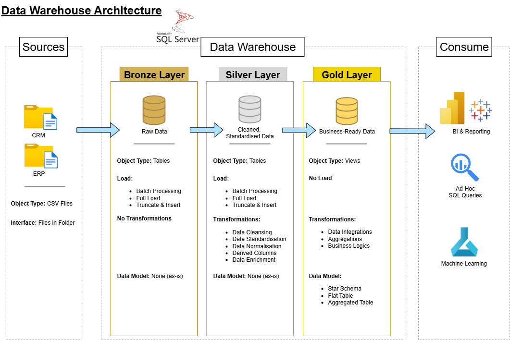

# Data Warehouse and Analytics Project

## 🌟 About Me

Hey, I'm **JunFai Kan**. I’m a Master of Data Science graduate passionate in pursuing my career in data engineering !

Let's connect on LinkedIn!

[](https://www.linkedin.com/in/junfaikan/)

--- 
Welcome to my **SQL Data Warehouse and Analytics Project** !

This project showcases an end-to-end data warehousing and analytics solution. It includes the end-to-end process of:
- building a data warehouse (DWH), ETL pipelines for data ingestion, transformation, and integration.
- creating data models (fact/dimension tables, star schema).
- perfoming BI analysis and generating actionable insights.

---
## 🏗️ Data Architecture

The data architecture for this project follows the Medallion Architecture **Bronze**, **Silver**, and **Gold** layers:


1. **Bronze Layer**: Stores raw data as-is from the source systems. Data is ingested from CSV Files into SQL Server Database.
2. **Silver Layer**: This layer includes data cleansing, standardization, and normalization processes to prepare data for analysis.
3. **Gold Layer**: Houses business-ready data modeled into a star schema required for reporting and analytics.

---
## 📖 Project Overview

This project involves:

1. **Data Architecture**: Designing a Data Warehouse Using the Medallion Architecture **Bronze**, **Silver**, and **Gold** layers.
2. **ETL Pipelines**: Extracting, transforming, and loading data from source systems into the warehouse.
3. **Data Modeling**: Developing fact and dimension tables optimized for analytical queries.
4. **Analytics & Reporting**: Creating SQL-based reports and dashboards for actionable insights.


---

## 🚀 Project Outline

### 🔧 Building the Data Warehouse (Data Engineering)

#### Objective:
Develop a modern data warehouse using Microsoft SQL Server to consolidate CRM and ERP sales data, enabling analytical reporting and informed decision-making.

#### Specifications:-
- **Data Sources**: Import data from two source systems (CRM and ERP) provided as CSV files.
- **Data Quality**: Cleanse and resolve data quality issues prior to analysis.
- **Integration**: Combine both sources into a single, user-friendly data model designed for analytical queries.
- **Scope**: Focus on the latest dataset only; historisation of data is not required.
- **Documentation**: Provide clear documentation of the data model to support both business stakeholders and analytics teams.

---

### 📊 BI: Analytics & Reporting (Data Analysis)

#### Objective:
Develop SQL-based analytics to deliver detailed insights into:-
- **Customer Behaviour**
- **Product Performance**
- **Sales Trends**

These insights empower stakeholders with key business metrics, enabling strategic decision-making.  

--- 

## 📂 Repository Structure
```
data-warehouse-project/
│
├── datasets/                             # Raw datasets used for the project.
│   ├── source_crm                        # CRM source data.
│       ├── cust_info.csv
│       ├── prd_info.csv
│       ├── sales_details.csv
│   ├── source_erp                        # ERP source data.
│       ├── CUST_AZ12.csv
│       ├── LOC_A101.csv
│       ├── PX_CAT_G1V2.csv
│
├── documents/                            # Project documentation and architecture details.
│   ├── data_catalogue.md                 # Catalog of datasets, including field descriptions and metadata.
│   ├── data_integration.png              # Draw.io file showing How CRM and ERP data sources integrate into unified entities.
│   ├── data_naming_rules.md              # Consistent naming guidelines for tables, columns, and files.
│   ├── dwh_project_architecture.png      # Draw.io file shows the Data Warehouse project's architecture.
│   ├── full_data_flow.png                # Draw.io file for the data flow diagram.
│   ├── sales_data_mart_star_schema.png   # Draw.io file for data models (star schema).
│
├── scripts/                              # SQL scripts for ETL and transformations.
│   ├── bronze/                           # Scripts for extracting and loading raw data.
│   ├── silver/                           # Scripts for cleaning and transforming data.
│   ├── gold/                             # Scripts for creating analytical models.
│
├── tests/                                # Test scripts and quality files.
│   ├── quality_checks_gold.sql           # Quality checks for the gold layer.
│   ├── quality_checks_silver.sql         # Quality checks for the silver layer.
│
├── LICENSE                               # License information for the repository.
├── README.md                             # Project overview and instructions.

```
---
